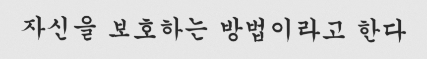
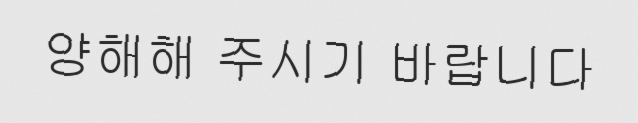

# 📝 TOPIK 손글씨 답안 OCR PoC

> 종이에 손으로 쓴 TOPIK 쓰기 답안을 **촬영만으로** 디지털화해서, 기존 자동 채점 파이프라인에 연결하는 PoC

TOPIK II 쓰기는 **실제 시험이 손으로 쓰는 방식**이라 학습자도 종이로 연습한다.
그런데 [직전에 만든 채점 웹앱](https://topic-write.onrender.com)에서 채점을 받으려면 답안을 **다시 타이핑**해야 한다.
이 PoC는 그 재타이핑 구간을 OCR로 대체한다.

```
[기존]  종이 답안 → 사람이 재타이핑 → 채점 엔진 → 피드백
[개선]  종이 답안 → 📷 촬영 → OCR + 한국어 후처리 → 채점 엔진 → 피드백
                            └────── 이 PoC의 범위 ──────┘
```

📄 문제 정의서: **[PROBLEM.md](PROBLEM.md)** · 🗺️ 다음 단계 제안서: **[NEXT_STEPS.md](NEXT_STEPS.md)**

📊 상세 측정 리포트

| 리포트 | 데이터 | 엔진 | 실행 환경 | CER |
|--------|--------|------|-----------|-----|
| [pagecompare_clova.md](results/pagecompare_clova.md) | **실제 손글씨** 5페이지 (통째) | CLOVA OCR | 클라우드 API | **0.037** ⬅ 최고 기록 |
| [report_real_clova.md](results/report_real_clova.md) | **실제 손글씨** 53행 / 필체 5종 | CLOVA OCR | 클라우드 API | 0.096 (단편 제외 0.075) |
| [report_real_surya.md](results/report_real_surya.md) | **실제 손글씨** 53행 / 필체 5종 | surya 0.17.1 | Colab T4 | 0.102 (단편 제외 **0.071**) |
| [report_real.md](results/report_real.md) | **실제 손글씨** 53행 / 필체 5종 | easyocr | Colab T4 | 0.196 (단편 제외 0.189) |
| [report.md](results/report.md) | 합성 샘플 12건 | easyocr | 로컬 CPU | 0.029 |

> **CPU/GPU 미세 차이**: 같은 코드·데이터라도 환경에 따라 값이 조금 다르다
> (합성 일치율: CPU 10/12 / GPU 9/12). 부동소수점 연산 차이 때문이며,
> **엔진 비교는 두 엔진을 모두 Colab T4 에서 잰 값**으로 통일했다.
>
> ⚠️ 위 두 리포트의 처리 시간 줄에 "CPU 전용"으로 적혀 있으나 **실제로는 T4 GPU 실행**이다.
> 기기 표기가 하드코딩되어 있던 버그이며 코드는 수정했다(다음 실행부터 올바르게 기록된다).

---

## 🚀 실행 방법

```bash
pip install -r requirements.txt
```

```bash
python poc.py gen        # 합성 답안 샘플 12건 + 정답 라벨 생성
python poc.py run        # OCR 실행 → 정확도 리포트 출력
python poc.py selfcheck  # 지표/후처리/파싱 로직 self-test
```

**OCR 엔진 교체** — 같은 벤치마크로 모델을 비교할 수 있다. GPU는 자동 감지된다.

```bash
python poc.py run --engine easyocr   # 기본값
python poc.py run --engine surya     # pip install surya-ocr 필요
python poc.py run --engine clova     # 환경변수 CLOVA_OCR_URL / CLOVA_OCR_SECRET 필요
```

**입력 단위 비교** — 페이지 통째 vs 행별 분할. 행별 결과는 앞선 `run` 의 JSON 을 재사용해 추가 호출이 없다.

```bash
python poc.py pagecompare --lines results/report_real_clova.json --engine clova
```

> 손글씨 사진이 없어도 바로 돌아간다. `gen` 이 한글 폰트로 답안 이미지를 만들고 **정답 라벨까지 자동 생성**하기 때문이다.
> 시드가 고정되어 있어 **누가 실행해도 동일한 샘플·동일한 결과**가 나온다.

**실제 손글씨로 측정하려면**: 사진을 `data/real/` 에 넣고 같은 폴더에 `labels.json`
(`{"파일명.jpg": {"text": "정답 문장"}}`) 을 만든 뒤 —

```bash
python poc.py run --data data/real
```

---

## 🖼️ 입력 샘플

측정에 쓴 데이터는 **두 종류**다. 아래 검증 결과에서 어느 쪽으로 잰 수치인지 구분해서 봐야 한다.

### A. 합성 샘플 — 레포에 포함 (12건)

`python poc.py gen` 이 한글 폰트로 생성한다 (궁서체 등 · 미세 회전 · 블러 · 노이즈).




⚠️ **폰트 렌더링이라 실제 육필이 아니다.** 손글씨 사진 없이도 파이프라인을 돌리기 위한 대용물이며,
아래에서 보듯 **실제 성능을 크게 과대평가**한다.

### B. 실제 손글씨 — 레포에 미포함 (53행 / 필체 5종)

핵심 수치는 **이쪽으로 측정한 값**이다.

| 항목 | 내용 |
|------|------|
| 출처 | [Nexdata 한국어 손글씨 OCR 공개 데모](https://github.com/Nexdata-AI/5711-Images-Korean-Handwriting-OCR-data) `002·007·008·009·010_demo.jpg` |
| 형태 | A4 필기 원고를 휴대폰으로 촬영한 사진 5장 → **자동 행 분할 53행** |
| 필체 | **5명** (편당 8~14행) |
| 정답 | 필자가 눈으로 읽어 직접 전사 (**따옴표·문장부호 포함**) |
| 미포함 사유 | 원본이 **상업 라이선스**라 재배포 불가 |

`prepare_real.py` 가 원본을 내려받아 **행 자동 검출 → 분할 → 정답 라벨 생성**까지 처리한다.

행 검출은 어노테이션 박스가 아니라 **글자의 가로 투영**으로 한다.
박스는 기울어지면 위아래 행의 세로 구간이 겹쳐 두 행이 하나로 병합되지만,
글자 사이에는 확실한 여백이 있어 안정적이다.

아래 [재현 방법](#-실제-손글씨-결과-재현하기) 참조.

---

## 📊 검증 결과

<details>
<summary><b>📐 먼저 — 지표 읽는 법 (CER · 일치율)</b> · 클릭해서 펼치기</summary>

<br>

**CER(문자 오류율) = 편집거리 ÷ 정답 글자수.** "정답으로 고치려면 몇 글자를 손대야 하나"의 비율이다.

```
CER 0.071  →  100자당 약 7자 틀림  →  93% 정확
CER 0.189  →  100자당 약 19자 틀림 →  81% 정확
```

| CER | 체감 | 본 PoC 결과 |
|-----|------|-------------|
| ~0.01 | 인쇄체 실용 수준, 거의 그대로 사용 | |
| 0.01~0.05 | 좋음. 가벼운 교정으로 사용 가능 | 합성 샘플 **0.029** |
| **0.05~0.10** | **초벌 전사로 쓸만함. 사람 교정 필요** | 실제 육필 surya **0.071** |
| 0.10~0.20 | 읽히긴 하나 교정 부담이 큼 | 실제 육필 easyocr **0.189** |
| 0.20~ | 실용 어려움 | |

### ⚠️ CER 과 일치율은 따로 움직인다

| | CER | 공백 무시 일치율 |
|---|-----|------------------|
| 합성 (easyocr) | 0.029 | **83%** |
| 실제 (surya) | 0.071 | **17%** |
| 실제 (easyocr) | 0.189 | **2%** |

CER 은 2.4배 차이인데 일치율은 83% → 17% 로 무너진다. 이유는 단순하다.

> **CER 은 평균이고, 완전일치는 "한 글자도 안 틀려야" 성립한다.**
> 40자 문장에서 CER 0.071 이면 평균 **2.8자**가 틀린다. 0자일 확률은 희박하다.

즉 **문장이 길수록 같은 CER 에서도 완전일치는 급락한다.**
합성 샘플이 83% 인 것은 성능이 좋아서가 아니라 **문장이 짧기 때문**이기도 하다(10~15자).
실제 육필은 40자가 넘는 행이라 같은 잣대로 비교하면 안 된다.

### 어느 지표를 볼 것인가 — 제품 방향에 따라 다르다

| 제품 방향 | 봐야 할 지표 | 이유 |
|-----------|--------------|------|
| 완전 자동 채점 (정답 문자열 비교) | **일치율** | 한 글자만 틀려도 오답 처리 |
| 초벌 전사 + 사용자 확인 (B 전략) | **CER** | 교정 노동량에 정비례 |
| **최선** | **채점 결과 일치율** | 글자가 몇 개 틀리든 **채점 결과가 같으면 실용상 충분** |

세 번째가 [PROBLEM.md](PROBLEM.md) 에 정의한 최종 판정 기준이며, 아직 측정하지 못한 항목이다.

### CER 의 맹점

1. **모든 글자를 똑같이 취급한다** — `기출`→`기童`(핵심어)과 따옴표 하나가 같은 감점.
   본 PoC 에서 surya 점수가 실제보다 낮게 나온 이유다.
2. **짧은 문장에 가혹하다** — 5자 문장에서 1자만 틀려도 CER 0.2.
3. **띄어쓰기 포함 여부로 값이 달라진다** — TOPIK 은 띄어쓰기도 채점 대상이므로 포함시켰다.
   제외하면 수치는 더 내려간다.

</details>

### 🏆 핵심 결과 — 실제 손글씨 53행 / 필체 5종, 엔진 3종 비교

**측정 조건**: [입력 샘플 B](#b-실제-손글씨--레포에-미포함-53행--필체-5종) · 후처리·정답·지표 계산 완전 동일 · 엔진만 교체

| 지표 | easyocr | surya | **CLOVA OCR** | 목표 |
|------|---------|-------|---------------|------|
| 평균 CER (전체 53행) | 0.196 | 0.102 | **0.096** | 0.15 이하 |
| 평균 CER (단편 제외 51행) | 0.189 | **0.071** | 0.075 | ✅ surya·CLOVA 달성 |
| **CER (띄어쓰기 무시)** | 0.193 | 0.096 | **0.054** | 참고 |
| **공백 무시 일치율** | 1/53 (2%) | 9/53 (17%) | **17/53 (32%)** | 80% → ❌ 전부 미달 |
| 완전 일치율 | 1/53 (2%) | 6/53 (11%) | **7/53 (13%)** | — |
| 처리 시간 | 0.15초 (T4) | 1.34초 (T4) | 1.13초 (API) | — |
| 실행 형태 | 로컬·무료 | 로컬·무료 | 클라우드·유료 | — |

```
정답     기출문제를 다 푼 뒤 선생님이 기말고사를 볼 때 볼펜으로 풀지 말고 연필로 연하게
easyocr  기술 눈제출 다 표 뒤 선심님이 기말고사 볼 때 불편로 풀지 말고 연필로 연하게
surya    기童문제를 다 푼 뒤 선범님이 기말고사를 볼 CH 볼펜O로 풀지 말고 연필로 연하고
CLOVA    기줄문 제를 다 푼 뒤 선생님이 기말고사를 볼때 볼펜으로 풀지 말고 연필로 연하게
```

#### 🥇 최고 기록 — 페이지 통째로 넣으면 CER 0.037

행별로 잘라 넣던 것을 **페이지 통째로** 바꾸자 정확도가 두 배가 됐다. 상세는 [D. 입력 단위 실험](#d-입력-단위-실험--전처리가-오히려-해로웠다) 참조.

| | 행별 분할 (53회 호출) | **페이지 통째 (5회 호출)** |
|---|---|---|
| 평균 CER | 0.073 | **0.037** |
| CER (띄어쓰기 무시) | 0.039 | **0.021** (글자 97.9% 정확) |

**더 싸고 더 정확하다.** 아래 엔진 비교표는 모두 *행별 분할* 기준이므로,
CLOVA 의 실제 최고 성능은 표의 값보다 좋다.

#### 🔑 CLOVA 는 글자를 읽고, 띄어쓰기를 놓친다

CER 만 보면 surya(0.071)와 CLOVA(0.075)는 사실상 동률이다. **그런데 띄어쓰기를 무시하면 역전된다.**

| | surya | CLOVA | 차이 |
|---|-------|-------|------|
| CER (띄어쓰기 포함) | 0.071 | 0.075 | 비슷 |
| CER (띄어쓰기 무시) | 0.096 | **0.054** | **1.8배** |
| 공백 제거 시 오류 감소폭 | 오히려 증가 | **28% 감소** | |

> **CLOVA 오류의 상당 부분은 글자가 아니라 공백이다.**
> `볼 때` → `볼때`, `요. 즉 학원에서` → `요.즉학 원에서` 처럼 어절을 붙이거나 엉뚱한 곳에서 끊는다.
> 반대로 **글자 자체의 인식률은 세 엔진 중 압도적으로 높다**(0.054).

이 차이가 실용성을 가른다 — 일치율이 CLOVA 32% vs surya 17% 로 **두 배**인 이유이기도 하다.
띄어쓰기는 규칙·사전으로 교정할 여지가 크지만, 글자 오인식은 그렇지 않다.
→ **CLOVA + 띄어쓰기 교정**이 현재 가장 유망한 조합이다.

⚠️ 단, TOPIK 은 **띄어쓰기도 채점 대상**이다. OCR 이 만든 띄어쓰기 오류와 학습자가 낸 띄어쓰기
오류를 구분할 수 없다면, 채점 피드백이 오히려 학습자를 오도한다. 이 구분은 미해결 과제다.

#### 왜 "단편 제외" 값을 병기하는가

`002_line12`("다."), `007_line10`("할가요?") 같은 **2~4글자 행**은 한 글자만 틀려도 CER 이 0.75~1.0 이 된다.
53행 평균에서 이 2건이 surya 의 CER 을 0.071 → 0.102 로 끌어올렸다.
TOPIK 답안 행으로서 대표성도 없으므로 **제외값을 함께 보고**하되, 제외 대상을 리포트에 명시한다.

#### 필체별 편차 — 엔진마다 성격이 다르다

| 필체 | easyocr CER | surya CER | CLOVA CER | CLOVA 일치 |
|------|-------------|-----------|-----------|------------|
| 002 | 0.196 | 0.157 | 0.127 | 1/12 |
| 007 | 0.226 | 0.113 | 0.139 | 2/10 |
| 008 | 0.181 | 0.073 | **0.065** | **5/9** |
| 009 | 0.188 | 0.065 | **0.055** | 3/8 |
| 010 | 0.190 | 0.083 | 0.082 | **6/14** |
| **편차** | 1.2배 | 2.4배 | 2.5배 | — |

easyocr 은 **모든 필체에서 고르게 나쁘고**, surya·CLOVA 는 **필체를 탄다**(2.4~2.5배).
세 엔진 모두 **002·007 을 어려워하고 008·009·010 을 잘 읽는다** — 엔진이 아니라 **필체 자체의 난이도**가 존재한다.

→ 실사용 시 **필체에 따라 체감 품질이 크게 달라진다.** 평균값이 아니라 **최악 필체 기준으로 설계**해야 하며,
단일 필체로 성능을 주장하면 안 된다.

> ⚠️ **이전 추정 정정**: 초기 11행 측정에서 "정답 전사에 따옴표를 뺐으므로 surya 실제 성능은
> 측정치보다 좋다"고 적었으나, **틀렸다.** 따옴표를 포함해 재측정하니 같은 필체(002)의 CER 이
> 0.092 → 0.157 로 **올랐다.** surya 는 따옴표를 인식하되 종류를 자주 혼동한다
> (`"` → `'`). 정답에 포함시키자 그 오류가 드러난 것이다.

### 데이터 종류별 — 합성이 실제를 얼마나 과대평가하는가 (easyocr · 로컬 CPU)

| 지표 | [입력 A] 합성 샘플 (12건) | [입력 B] 실제 손글씨 (53행) |
|------|---------------------------|------------------------------|
| 평균 CER (원본 → 후처리) | 0.072 → **0.029** | 0.196 → **0.196** |
| 공백 무시 일치율 | 3/12 → **10/12 (83%)** | 1/53 → **1/53 (2%)** |
| 후처리 효과 | **+58%p** | **거의 없음** |

→ **같은 엔진인데 83% vs 2%.** 폰트로 만든 합성 샘플은 실제 성능의 근거가 될 수 없다.

단, 이 격차에는 **문장 길이 효과도 섞여 있다.** 합성 샘플은 10~15자, 실제 육필 행은 40자 이상이라
같은 CER 이라도 완전일치 확률이 크게 다르다 (위 [지표 읽는 법](#-검증-결과) 참조).
**공정한 비교는 CER 로 봐야 하며, 그 값도 0.029 vs 0.196 으로 7배 차이다.**

---

### A. 합성 샘플 (12건) — 목표 달성

| 지표 | OCR 원본 | **후처리 적용** | 목표 | 달성 |
|------|----------|-----------------|------|------|
| 평균 CER (문자 오류율) | 0.072 | **0.029** | 0.15 이하 | ✅ |
| 공백 무시 일치율 | 3/12 (25%) | **10/12 (83%)** | 80% 이상 | ✅ |
| 이미지 1장 처리 시간 | — | **8.55초** | 5초 이하 | ❌ (CPU 한계) |

### 기존 방식과의 비교

| 문항 | 기존: 재타이핑 (추정) | PoC: 촬영 + OCR | 결과 |
|------|----------------------|-----------------|------|
| 51·52번 (한 문장) | 약 20초 | 약 9초 | 개선되나 체감 폭 작음 |
| 54번 (600~700자) | **약 5~8분** | **약 9초** | **압도적 개선** |

→ 분량이 큰 문항일수록 효용이 커진다. **54번이 이 PoC의 핵심 수혜 구간.**

### 🔑 핵심 발견 — 오류가 한 곳에 몰려 있었다

OCR 원본의 실패 9건을 분석하니 **전부 종성(받침) 오인식**이었다.

| 오류 유형 | 사례 | 건수 |
|-----------|------|------|
| 종성 ㅂ → ㅁ | 바**랍**니다 → 바**람**니다 | 3 |
| 조사 을 → 올 | 동물**을** → 동물**올** | 3 |
| 종성 ㄱ → ㅋ | 감사하**겠**습니다 → 감사하**켓**습니다 | 1 |
| 종성 ㅆ → ㅅ | 나타**났**다 → 나타**낫**다 | 1 |
| 기타 (를→름, 뿐→분) | 공기**를** → 공기**름** | 1 |

평균 CER은 0.072로 이미 낮았다(글자의 93%가 정확). **문장마다 딱 한 글자, 그것도 받침만 틀려서**
완전일치율만 25%로 주저앉은 것이다. 즉 **모델을 바꿀 문제가 아니라 후처리로 풀 문제**였다.

### 해결 — 한국어 문법 기반 후처리

관측된 오답을 보고 짜맞춘 규칙이 아니라, **한국어에 존재하지 않는 형태**를 근거로 교정한다.

| 규칙 | 근거 |
|------|------|
| 종성 ㅁ + `니다` → ㅂ + `니다` | 한국어에 `-ㅁ니다` 어미는 없다 |
| 어절 끝 `올` → `을` | `올`은 목적격 조사가 아니다 |
| `켓습니다` → `겠습니다` | 한국어에 `-켓습니다` 어미는 없다 |

**결과: 일치율 25% → 83%, CER 0.072 → 0.029** (모델 변경·재학습 없음)

과교정(멀쩡한 글자를 망가뜨리는 것)을 막기 위해 `selfcheck` 에 방어 테스트를 넣었다 —
`감사합니다`·`없습니다`·`서울에`·`올해는` 이 변형되지 않는지 검증한다.

### ❌ 남은 실패 사례 (정직하게)

| 정답 | 결과 | 왜 안 고쳤나 |
|------|------|--------------|
| 건강에 도움이 되는 것으로 나타**났**다 | 나타**낫**다 | `낫다`(병이 낫다)가 실제 단어라 일괄 교정 시 오히려 오류 발생 |
| **공기를 통해서뿐만** 아니라 | **공기름 통해 서분만** | 어절 끝 `름`→`를` 교정은 `이름`·`여름`·`구름` 을 망가뜨림 |

→ 두 경우 모두 **문맥 없이 규칙만으로는 안전하게 교정 불가.** 사전·언어모델 기반 후처리가 필요한 구간이다.

---

### B. 실제 손글씨 (53행) — easyocr 목표 미달

> 아래는 **easyocr 기준** 결과다. 이후 [C. 엔진 교체 실험](#c-엔진-교체-실험-colab-t4-gpu)에서 결론이 일부 뒤집힌다.

합성 샘플만으로는 실제 성능을 알 수 없어, **공개된 실제 한글 손글씨 사진**([입력 샘플 B](#b-실제-손글씨--레포에-미포함-53행--필체-5종))으로 재측정했다.

측정 환경: **Colab T4** · 리포트: [results/report_real.md](results/report_real.md)

| 지표 | OCR 원본 | 후처리 적용 | 목표 | 달성 |
|------|----------|-------------|------|------|
| 평균 CER | 0.196 | **0.196** | 0.15 이하 | ❌ |
| 공백 무시 일치율 | 1/53 (2%) | **1/53 (2%)** | 80% 이상 | ❌ |

**한 건도 정확히 읽어내지 못했다.**

```
정답  기출문제를 다 푼 뒤 선생님이 기말고사를 볼 때 볼펜으로 풀지 말고 연필로 연하게
결과  기술 눈제출 다 표 뒤 선심님이 기말고사큼 볼 때 불편로 풀지 말고 연필로 연하게

정답  선생님이 알려 주셨는데 기출문제을 학원에 주면 안 되지않을까? 그래서
결과  선생님이 알려 주 _눈데 기출문제을 학원에 주면 안 되지않 올 까? 그러서
```

#### 교란 변수 통제 — 어노테이션 박스는 원인이 아니었다

데모 이미지에는 초록색 어노테이션 박스가 인쇄되어 글자와 겹쳐 있었다.
"손글씨가 어려운 것"과 "박스가 방해한 것"을 분리하기 위해 박스를 배경색으로 제거하고 재측정했다.

| 조건 | 평균 CER (원본) |
|------|-----------------|
| 초록 박스 있음 | 0.229 |
| 초록 박스 제거 | 0.226 |

→ **차이 없음.** 성능 저하의 원인은 박스가 아니라 **손글씨 자체**임이 확인됐다.

#### 왜 후처리가 실제 데이터에서는 안 통했나

| | 합성 샘플의 오류 | 실제 손글씨의 오류 |
|---|---|---|
| 오류 위치 | **종성(받침)에만 집중** | 초성·중성·종성 **전방위** |
| 어절 경계 | 대체로 유지 | **과분할** (`기출문제를` → `기 출문 제틀`) |
| 대표 사례 | 바랍니다→바람니다 | 선생님→선심님, 복제→목제, 위반→우반 |
| 규칙 3개로 커버 | ✅ 25%→83% | ❌ 0%→0% |

합성 데이터의 오류는 "받침 하나"라는 **좁고 규칙적인** 형태였기에 문법 규칙으로 잡혔다.
실제 손글씨는 오류가 글자 전체에 퍼져 있어 **규칙 기반 후처리의 사정거리를 벗어난다.**

#### 📌 이 실험이 증명한 것

> **합성 샘플로 측정한 83%는 실제 성능을 심각하게 과대평가했다.**
> easyocr 의 실제 값은 0%였다. "합성 결과는 성능의 상한선"이라는 가정이 **실측으로 확인**됐다.

---

### C. 엔진 교체 실험 (Colab T4 GPU)

"모델이 손글씨를 학습하지 않은 것"이 원인이라면 **다른 모델은 다를 수 있다**는 가설을 검증했다.
데이터([입력 샘플 B](#b-실제-손글씨--레포에-미포함-11건))·후처리·CER 계산·정답 라벨은 **완전히 동일**하고 엔진만 교체했다.

| 엔진 | 평균 CER | 일치율 | 리포트 | 비고 |
|------|----------|--------|--------|------|
| easyocr | 0.189 | 1/53 | [report_real.md](results/report_real.md) | 인쇄체 중심 학습 |
| **surya 0.17.1** | **0.071** | 9/53 | [report_real_surya.md](results/report_real_surya.md) | 문서·다국어 학습, 어절 구조 유지 |

(CER 은 10자 미만 단편 2건을 제외한 51행 기준)

**오류의 성격이 다르다:**

| | easyocr | surya |
|---|---|---|
| 어절 경계 | **붕괴** (`기출문제를`→`기 출문 제틀`) | **유지** (`기출문제를` ✅) |
| 오류 형태 | 자모 전방위 붕괴 | **드문 글자 오치환** (`기출`→`기童`, `선생님`→`선범님`) |
| 후처리 효과 | +0%p | +0%p (오류 유형이 달라 규칙이 안 맞음) |

surya 는 문장 구조를 유지한 채 **개별 글자 몇 개만 틀린다.** 사람이 읽고 고치기 훨씬 쉬운 형태다.

#### 실행 중 만난 문제 (재현 시 참고)

| 문제 | 해결 |
|------|------|
| surya 0.22.1 은 모든 백엔드가 외부 서버·컨테이너 기반 (vLLM=Docker, openai_client=API 서버) | Colab 에서 Docker 불가 → **0.17.1 로 다운그레이드** (인프로세스 torch 추론) |
| surya 0.17.1 + transformers 5.x → `SuryaDecoderConfig has no attribute pad_token_id` | `transformers<5` 로 고정 |

```bash
pip install "surya-ocr==0.17.1" "transformers<5"
```

#### 📌 결론 수정

앞선 "가설 기각"은 **easyocr 에 한정된 결론**이었다. 엔진을 바꾸자 **CER 목표(0.15)는 달성**됐다.

도메인 관점의 함의:
- **51/52번 자동채점** (정답 문자열 비교): 일치율 9% 로 **여전히 불가**
- **B 전략(초벌 전사 + 사용자 확인)**: CER 0.071 = 글자의 **93% 정확**, 어절 구조도 유지 → **실현 가능성이 크게 올라감**
  (단, 필체에 따라 0.065~0.157 로 흔들리므로 최악 필체 기준으로 설계해야 한다)
- **문법 자동 첨삭**: OCR 오류를 문법 오류로 오탐할 위험은 남아 있음

---

### D. 입력 단위 실험 — 전처리가 오히려 해로웠다

**질문**: 실제 학습자는 답안지를 통째로 촬영한다. 우리가 행 단위로 잘라 넣는 전처리는 정확도에 기여할까?

정답·엔진·후처리·지표를 **완전히 동일하게** 두고 **입력 단위만** 바꿔 측정했다.
(전면 이미지도 행 크롭과 똑같이 어노테이션 박스를 제거해 공정성을 맞췄다.)

| 항목 | 행별 분할 | **페이지 통째** |
|------|-----------|-----------------|
| API 호출 수 | 53회 | **5회** (10.6배 절감) |
| 평균 CER | 0.073 | **0.037** |
| CER (띄어쓰기 무시) | 0.039 | **0.021** |

| 페이지 | 행별 CER | 페이지 CER | 차이 |
|--------|----------|------------|------|
| 002 | 0.092 | 0.040 | **−0.052** |
| 007 | 0.078 | 0.045 | −0.033 |
| 008 | 0.062 | 0.026 | −0.035 |
| 009 | 0.054 | 0.038 | −0.016 |
| 010 | 0.081 | 0.033 | −0.047 |

**5개 페이지 전부에서 페이지 통째가 더 정확했다.**

#### 왜 전처리가 해로웠나 (추정)

- **엔진의 레이아웃 분석을 우회했다.** CLOVA 는 자체 행 검출을 갖고 있고, 그쪽이 우리의
  가로 투영 방식보다 정교하다. 잘라서 넣는 순간 그 기능을 못 쓰게 된다
- **극단적 가로세로비.** 행 크롭은 3024×120 으로 일반 문서와 동떨어진 형태다
- **문맥 상실.** 페이지 전체를 보면 글자 크기·기준선·필체를 문서 단위로 보정할 수 있다
- **획 잘림.** 크롭 패딩(12px)이 위아래 획을 자를 수 있다

#### 📌 배운 것

> **전처리가 항상 도움이 되는 것은 아니다.**
> 전용 엔진이 이미 잘하는 일을 앞단에서 대신하면, 도와주는 게 아니라 방해가 된다.
> 이 실험은 **비용(10배)과 정확도(2배)를 동시에** 개선했다 — 코드를 지워서 얻은 개선이다.

제품 관점에서도 유리하다. 페이지 방식은 **실사용 흐름(답안지 한 장 촬영) 그 자체**라
행 분할 전처리를 파이프라인에서 들어낼 수 있다.

⚠️ **주의**: 위 엔진 3종 비교는 모두 *행별 분할* 입력으로 측정했다.
이제 그 입력 형태가 불리하다는 것이 밝혀졌으므로, **엔진 순위가 페이지 단위에서도 같다는 보장은 없다.**
공정한 재비교가 필요하다(아래 다음 단계 참조).

---

## 🤖 모델 선정 근거

핵심 과제가 "손글씨 한국어 → 텍스트" 이므로 OCR 계열로 후보를 좁혔다.

| 후보 | 판단 | 이유 |
|------|------|------|
| **EasyOCR** | ✅ 측정 | 한국어 사전학습, `pip` 단독 설치, 완전 오프라인 → 기준선으로 채택. **결과: 손글씨에 부적합 (0.189)** |
| **surya 0.17.1** | ✅ 측정 | 문서·다국어 특화. **로컬·무료 중 최고 (0.071)** → 실사용 후보 |
| **CLOVA OCR** | ✅ 측정 | 한국어 특화 상용 API. **글자 인식 최고 (0.054)** 이나 클라우드라 상용화엔 제약 → **상한선 기준**으로 활용 |
| Tesseract | 기각 | 손글씨에 특히 취약, 별도 바이너리 설치로 재현성 저하 |
| PaddleOCR | 기각 | 추론 엔진(`paddlepaddle`) 설치가 Windows 에서 까다로워 "누구나 실행" 조건에 불리 |
| Google Cloud Vision | 기각 | CLOVA 로 클라우드 상한선을 이미 확인했고, 결제수단 등록 등 진입 비용이 추가로 큼 |
| 비전 LLM | 보류 | 출력이 비결정적이라 **"누구나 같은 결과"** 재현성 조건과 충돌 |
| YOLO / SAM | 기각 | 답안지는 **단일 텍스트 영역**이라 객체탐지·세그멘테이션이 기여하는 바 없음 |

세 엔진을 **같은 데이터·같은 지표**로 재어 본 것이 이 PoC 의 핵심 산출물이다.
"로컬에서 쓸 수 있는 최선(surya 0.071)"과 "도달 가능한 상한(CLOVA 0.054)"을 동시에 확보해,
이후 파인튜닝의 목표치를 숫자로 말할 수 있게 되었다.

---

## ⚠️ 한계

1. **완전 자동 채점은 아직 불가.** 최고 성능(CLOVA)에서도 행 단위 일치율 32% 로,
   정답 문자열 비교 방식의 51/52번 자동채점에는 못 쓴다.
   CER 목표는 달성했지만 일치율 목표(80%)는 여전히 크게 미달이다.
2. **엔진 순위는 행별 분할 기준이다.** 페이지 단위가 유리하다는 것이 밝혀졌으므로,
   easyocr·surya 를 페이지 단위로 재측정하기 전까지 **3종 순위는 잠정값**이다.
2. **최고 성능 엔진은 로컬에서 못 쓴다.** CLOVA 는 클라우드 API 라 **답안 이미지가 외부로 전송**된다.
   필적은 개인정보이므로 상용화 시 그대로 쓸 수 없고, 온프레미스 대안이 필요하다.
   즉 **현재 최고 정확도(0.054)는 "쓸 수 있는 값"이 아니라 "도달 가능한 상한선"** 이다.
3. **필체 편차가 크다.** surya·CLOVA 모두 필체에 따라 CER 이 **2.4~2.5배** 차이 난다.
   표본을 5명으로 늘려 확인한 사실이며, 평균값만으로 사용자 경험을 예측할 수 없다.
3. **표본이 여전히 제한적이다.** 53행 / 필체 5종은 통계적 신뢰구간을 좁히기엔 작다.
   또한 모두 **한국인 필체**이며, 실제 타겟인 외국인 학습자 필체는 포함되지 않았다.
4. **정답 전사는 사람 판독이다.** 판독이 모호한 글자(예: 007 의 `폼출할`)가 있어
   전사 오류 가능성이 남는다.
5. **규칙 기반 후처리는 확장성이 없다.** 합성 데이터에서만 +58%p였고 실제 데이터에서는 두 엔진 모두 0%p였다.
6. **단일 행 기준.** 54번(600~700자, 여러 줄) 답안지는 줄 분리·정렬 처리가 추가로 필요하다.
7. **surya 는 버전 제약이 있다.** 0.20+ 는 Docker 등 외부 백엔드를 요구해 Colab·로컬에서 바로 못 쓴다.
8. **속도 비용.** surya 는 easyocr 보다 9배 느리다(T4 기준 1.34초 vs 0.15초).

## 🗺️ 다음 단계

- [x] ~~정답 전사에 따옴표 포함해 재측정~~ → 완료. 추정과 달리 CER 이 **올랐다**(위 정정 참조)
- [x] ~~필체 3~5명분으로 표본 확대~~ → 완료. 필체 5종 53행, **편차 2.4배** 확인
- [x] ~~띄어쓰기 무시 지표 추가~~ → 완료. surya 0.102 → 0.096 (띄어쓰기가 주원인은 아님)
- [x] ~~한국어 특화 상용 엔진(CLOVA) 측정~~ → 완료. **글자 인식은 최고(0.054)이나 띄어쓰기가 약점**
- [x] ~~페이지 통째 입력 실험~~ → 완료. **CER 0.073 → 0.037, 호출 10배 절감. 전처리가 해로웠음**
- [ ] **엔진 3종을 페이지 단위로 재비교** ← 현재 순위는 행별 분할 기준이라 재확인이 필요하다.
      easyocr·surya 는 Colab 에서 이미지 5장만 돌리면 되므로 비용이 거의 없다
- [ ] **띄어쓰기 교정 후처리** ← 저렴하고 효과가 클 후보.
      CLOVA 오류의 상당수가 공백이며, 글자 정확도는 이미 0.054 다.
      띄어쓰기만 교정해도 일치율 32% 가 크게 오를 여지가 있다
- [ ] **B 전략 사용성 검증** — CER 0.054~0.075 초안을 고치는 것이 백지 타이핑보다 빠른지 측정.
      **제품 방향 자체의 타당성 판정**
- [ ] **채점 결과 일치율 측정** — `PROBLEM.md` 가 정의한 최종 판정 기준이나 아직 미측정
- [ ] **OCR 띄어쓰기 오류 vs 학습자 띄어쓰기 오류 구분** — 구분 못 하면 채점이 학습자를 오도한다
- [ ] 외국인 학습자 필체 확보 — 현재 표본은 전원 한국인이며, 실제 타겟과 다르다
- [ ] 로컬 모델(surya)을 한글 손글씨로 파인튜닝 — **CLOVA 상한선(0.054)에 얼마나 근접하는지**가 기준
- [ ] 필체 난이도 원인 분석 — 세 엔진 모두 002·007 을 어려워한 이유

> 이 PoC가 남긴 것은 결과보다 **재사용 가능한 평가 파이프라인**이다.
> 덕분에 "easyocr 실패 → surya 로 교체 → CER 59% 개선"을 **엔진 인자 하나만 바꿔** 검증할 수 있었다.

## 📁 구조

```
poc.py                  전체 파이프라인 (gen / run / selfcheck)
prepare_real.py         실제 손글씨 사진 → 행 단위 크롭 + 정답 라벨
PROBLEM.md              문제 정의서
requirements.txt
data/samples/           합성 샘플 + labels.json (정답)
data/real/              실제 손글씨 (상업 라이선스라 커밋 제외)
results/report.md       합성 샘플 정확도 리포트
results/report_real.md  실제 손글씨 정확도 리포트
```

## 🔁 실제 손글씨 결과 재현하기

```bash
curl -L -o data/real/002_demo.jpg \
  https://raw.githubusercontent.com/Nexdata-AI/5711-Images-Korean-Handwriting-OCR-data/main/002_demo.jpg
python prepare_real.py
python poc.py run --data data/real --out results/report_real.md
```
