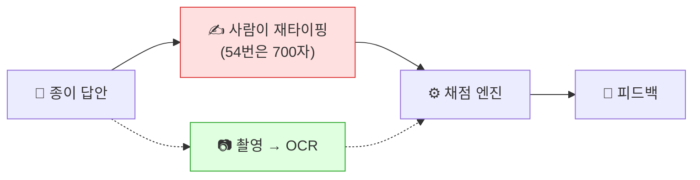

<div align="center">

# 📝 TOPIK 손글씨 답안 OCR PoC

**종이에 손으로 쓴 TOPIK 답안을 촬영만으로 디지털화해, 기존 자동 채점에 연결한다**

문제 정의서 · 실험 기록 · 상용화 제안서까지 갖춘 검증 프로젝트

[](PROBLEM.md)
[](EXPERIMENTS.md)
[](NEXT_STEPS.md)
[](RETROSPECTIVE.md)

</div>

---

## 🎯 한눈에 보기

TOPIK II 쓰기는 **실제 시험이 손으로 쓰는 방식**이라 학습자도 종이로 연습한다.
그런데 [직전에 만든 채점 웹앱](https://topic-write.onrender.com)에서 채점받으려면 답안을 **다시 타이핑**해야 한다.
이 PoC 는 그 재타이핑 구간을 OCR 로 대체할 수 있는지 검증했다.



### 결론

| 질문 | 답 |
|------|-----|
| 손글씨를 읽을 수 있는가 | ✅ **읽을 수 있다** — CER 0.037 (글자 96% 정확) |
| 완전 자동 채점이 되는가 | ❌ **아직 안 된다** — 행 단위 완전일치 32% |
| 그럼 무엇을 만들 수 있나 | ✅ **초벌 전사 + 사용자 확인** — 정확도 요건 이미 충족 |
| 비용은 | **답안지 1장 = 3원** (무료 100건/월) |

---

## 📊 핵심 결과

실제 손글씨 **53행 / 필체 5종** 기준. 정답·후처리·지표 계산은 모두 동일하고 조건만 바꿨다.

```
CER (문자 오류율) — 낮을수록 좋음

easyocr  행별   0.189  ████████████████████████████
surya    행별   0.071  ██████████
CLOVA    행별   0.075  ███████████
CLOVA    페이지 0.037  █████                      ← 최고
CLOVA    병합   0.038  █████   (호출 5회 → 1회)
                       └ 목표선 0.15 ┘
```

| 엔진 | 최적 입력 | CER | 일치율 | 속도 | 실행 |
|------|-----------|-----|--------|------|------|
| 🥇 **CLOVA OCR** | 페이지 통째 | **0.037** | 32% | 1.13초 | 클라우드·유료 |
| 🥈 **surya 0.17.1** | 행별 분할 | 0.071 | 17% | 1.34초 | 로컬·무료 |
| 🥉 easyocr | 행별 분할 | 0.189 | 2% | 0.15초 | 로컬·무료 |

> **엔진 순위는 입력 형태와 무관하게 동일했다.** 다만 **최적 입력은 엔진마다 다르다** —
> CLOVA 는 페이지 통째, easyocr·surya 는 행별 분할이 유리하다.

---

## 💡 발견 5가지

### 1️⃣ 합성 샘플은 실제를 심하게 과대평가한다

| 데이터 | CER | 일치율 |
|--------|-----|--------|
| 합성 (폰트 렌더링) | 0.029 | **83%** |
| 실제 육필 | 0.196 | **0%** |

같은 엔진(easyocr)인데 이만큼 벌어진다. **폰트로 만든 샘플은 성능 근거가 될 수 없다.**

### 2️⃣ 전처리가 오히려 해로웠다

행별로 잘라 넣던 것을 페이지 통째로 바꾸자 (CLOVA 기준)

| 입력 방식 | CER | API 호출 |
|-----------|-----|----------|
| 행별 분할 | 0.073 | 53회 |
| **페이지 통째** | **0.037** | **5회** |

**더 싸고 더 정확하다.** 엔진이 이미 갖춘 레이아웃 분석을 앞단에서 가로막고 있었다.
→ 단, 이 이점은 **CLOVA 고유**다. easyocr·surya 는 반대로 행별이 유리했다.

### 3️⃣ 해상도 여유가 매우 크다

단일 페이지를 배율별로 재보니 **줄여도 정확도가 떨어지지 않았다.**

| 배율 | 크기 | CER |
|------|------|-----|
| 100% | 3024×2214 | 0.057 |
| 50% | 1512×1107 | 0.050 |
| **15%** | **453×332** | **0.042** ← 원본보다 좋다 |

축소가 종이 질감·촬영 노이즈를 평활화해 오히려 유리하게 작용한 것으로 보인다.
→ **클라이언트에서 축소 후 전송**해도 된다 (1.9MB → 0.1MB).

### 4️⃣ 후처리로는 일치율을 못 올린다

가장 잦은 혼동 `ㅊ → ㅈ` 는 오류 행의 **28%** 에 등장한다. 고칠 가치가 있어 보였다.
그러나 **그것만 고쳐 완전 복구되는 행은 0건**이었다.

> 글자 오류 **61건이 36행에 분포** → 행당 평균 **1.7건**이 겹쳐 있다.
> 완전일치는 한 행의 **모든** 오류를 동시에 고쳐야 달성된다.

→ 일치율을 올리려면 후처리가 아니라 **인식률 자체**를 올려야 한다.

### 5️⃣ CLOVA 는 글자를 읽고, 띄어쓰기를 놓친다

| 지표 | surya | CLOVA |
|------|-------|-------|
| CER (띄어쓰기 포함) | 0.071 | 0.075 ← 비슷 |
| CER (띄어쓰기 **무시**) | 0.096 | **0.054** ← 1.8배 우위 |

`볼 때` → `볼때` 처럼 어절을 붙이거나 엉뚱한 곳에서 끊는다.
**글자 자체는 세 엔진 중 압도적으로 잘 읽는다.**

⚠️ 다만 TOPIK 은 띄어쓰기도 채점하므로, OCR 이 만든 오류와 학습자가 낸 오류를 구분할 수 없다.
→ **채점에서 띄어쓰기 항목은 제외하거나 "불확실" 표시**가 필요하다. 제품 설계 사항이다.

---

## 🚀 실행 방법

```bash
pip install -r requirements.txt
python poc.py gen        # 합성 샘플 12건 + 정답 라벨 생성 (시드 고정)
python poc.py run        # OCR 실행 → 정확도 리포트
python poc.py selfcheck  # 지표·후처리·파싱 로직 self-test
```

> 손글씨 사진이 없어도 바로 돌아간다. `gen` 이 한글 폰트로 답안 이미지를 만들고 정답 라벨까지 생성한다.

<details>
<summary><b>엔진 교체 · 실제 손글씨 재현 · 부가 실험</b></summary>

<br>

**엔진 교체** (GPU 자동 감지)

```bash
python poc.py run --engine easyocr   # 기본값
python poc.py run --engine surya     # pip install "surya-ocr==0.17.1" "transformers<5"
python poc.py run --engine clova     # 환경변수 CLOVA_OCR_URL / CLOVA_OCR_SECRET 필요
python poc.py run --engine paddle    # Linux 필요 (본 환경에서는 실행 실패)
```

**실제 손글씨 재현**

```bash
curl -L -o data/real/002_demo.jpg https://raw.githubusercontent.com/Nexdata-AI/5711-Images-Korean-Handwriting-OCR-data/main/002_demo.jpg
python prepare_real.py
python poc.py run --data data/real
```

`prepare_real.py` 가 행 자동 검출 → 분할 → 정답 라벨 생성까지 처리한다.
검출은 어노테이션 박스가 아니라 **글자의 가로 투영**으로 한다
(박스는 기울어지면 위아래 행이 병합된다).

**부가 실험**

```bash
python poc.py pagecompare --lines results/report_real_clova.json  # 페이지 vs 행별
python poc.py trimtest      # 여백 제거 효과
python poc.py mergetest     # 축소율-정확도 곡선
python analyze_errors.py    # 오류 유형 분해 (API 호출 0회)
```

</details>

---

## 🖼️ 사용한 데이터

| | A. 합성 샘플 | B. 실제 손글씨 |
|---|---|---|
| 규모 | 12건 | **53행 / 필체 5종** |
| 출처 | 한글 폰트 렌더링 | [Nexdata 공개 데모](https://github.com/Nexdata-AI/5711-Images-Korean-Handwriting-OCR-data) 5장 |
| 정답 | 자동 생성 | 사람이 눈으로 전사 |
| 레포 포함 | ✅ | ❌ (상업 라이선스) |
| 용도 | 파이프라인 검증 | **모든 핵심 수치의 근거** |


⚠️ 합성 샘플은 실제 육필이 아니다. 위 [발견 1](#-발견-5가지) 참조.

---

## 📐 지표 읽는 법

<details>
<summary><b>CER 과 일치율은 왜 따로 움직이는가</b> · 클릭해서 펼치기</summary>

<br>

**CER(문자 오류율) = 편집거리 ÷ 정답 글자수.** "정답으로 고치려면 몇 글자를 손대야 하나"의 비율.

| CER | 체감 | 본 PoC |
|-----|------|--------|
| ~0.01 | 인쇄체 실용 수준 | |
| 0.01~0.05 | 가벼운 교정으로 사용 가능 | **CLOVA 0.037** |
| 0.05~0.10 | 초벌 전사로 쓸만함 | **surya 0.071** |
| 0.10~0.20 | 교정 부담이 큼 | |
| 0.20~ | 실용 어려움 | easyocr 0.189 |

### 둘이 따로 움직이는 이유

| | CER | 일치율 |
|---|-----|--------|
| 합성 (easyocr) | 0.029 | **83%** |
| 실제 (CLOVA) | 0.075 | **32%** |
| 실제 (easyocr) | 0.189 | **2%** |

> **CER 은 평균이고, 완전일치는 "한 글자도 안 틀려야" 성립한다.**
> 40자 문장에서 CER 0.071 이면 평균 2.8자가 틀린다. 0자일 확률은 희박하다.

즉 **문장이 길수록 같은 CER 에서도 일치율은 급락한다.**
합성 샘플이 83% 인 것은 성능이 좋아서만이 아니라 **문장이 짧기 때문**(10~15자)이기도 하다.

### 어느 지표를 볼 것인가

| 제품 방향 | 지표 | 이유 |
|-----------|------|------|
| 완전 자동 채점 | **일치율** | 한 글자만 틀려도 오답 처리 |
| 초벌 전사 + 사용자 확인 | **CER** | 교정 노동량에 정비례 |
| **최선** | **채점 결과 일치율** | 글자가 틀려도 채점 결과가 같으면 충분 (미측정) |

### CER 의 맹점

1. **모든 글자를 똑같이 취급** — 핵심어 오류와 따옴표 하나가 같은 감점
2. **짧은 문장에 가혹** — 5자에서 1자 틀리면 CER 0.2
   → 본 PoC 는 10자 미만 단편 2건을 제외한 값을 병기한다
3. **띄어쓰기 포함 여부로 값이 달라짐** — TOPIK 은 띄어쓰기도 채점하므로 포함시켰다

</details>

---

## 🤖 모델 선정 근거

핵심 과제가 "손글씨 한국어 → 텍스트" 이므로 OCR 계열로 후보를 좁혔다.

| 후보 | 판단 | 이유 |
|------|------|------|
| **CLOVA OCR** | ✅ 측정 | 한국어 특화 상용. **글자 인식 최고(0.054)** 이나 클라우드라 상용화 제약 → **상한선 기준** |
| **surya 0.17.1** | ✅ 측정 | 문서·다국어 특화. **로컬·무료 중 최고(0.071)** → 실사용 후보 |
| **easyocr** | ✅ 측정 | 오프라인·간편 설치로 기준선 채택. **결과: 손글씨에 부적합(0.189)** |
| PaddleOCR | ⚠️ 실행 실패 | 설치·API 확인은 성공, **추론에서 3회 모두 실패**(Segfault → oneDNN 비호환). **정확도 미측정** |
| Tesseract | 기각 | 손글씨에 특히 취약, 별도 바이너리 설치로 재현성 저하 |
| Google Cloud Vision | 기각 | CLOVA 로 클라우드 상한을 이미 확인, 결제수단 등록 등 진입 비용 |
| 비전 LLM | 보류 | 출력이 비결정적 → **"누구나 같은 결과"** 재현성 조건과 충돌 |
| YOLO / SAM | 기각 | 답안지는 **단일 텍스트 영역**이라 객체탐지·세그멘테이션이 기여할 바 없음 |

> 세 엔진을 **같은 데이터·같은 지표**로 잰 것이 이 PoC 의 핵심 산출물이다.
> "로컬에서 쓸 수 있는 최선(0.071)"과 "도달 가능한 상한(0.037)"을 동시에 확보해,
> 이후 파인튜닝의 목표치를 숫자로 말할 수 있게 되었다.

---

## ⚠️ 한계

| # | 한계 | 내용 |
|---|------|------|
| 1 | **완전 자동 채점 불가** | 최고 성능에서도 일치율 32%. 목표 80% 에 크게 미달 |
| 2 | **최고 모델을 상용화에 못 쓴다** | CLOVA 는 클라우드 → 필적(개인정보)이 외부 전송. 온프레미스는 0.071 로 2배 나쁨 |
| 3 | **필체 편차 2.4~2.5배** | CER 0.065~0.157. 평균이 아니라 **최악 필체 기준**으로 설계해야 한다 |
| 4 | **타겟 필체 미검증** | 표본이 전원 **한국인**. 실제 타겟인 외국인 학습자는 획순·자모 형태가 다르다 |
| 5 | **표본이 작다** | 53행 / 5명. 통계적 신뢰구간을 좁히기엔 부족 |
| 6 | **정답은 사람 판독** | 판독이 모호한 글자가 있어 전사 오류 가능성이 남는다 |
| 7 | **띄어쓰기 채점 불가** | OCR 오류와 학습자 오류를 구분할 수 없다 |
| 8 | **surya 버전 제약** | 0.20+ 는 Docker 등 외부 백엔드 필요 → 0.17.1 + `transformers<5` 고정 |

---

## 🗺️ 다음 단계

상세는 **[NEXT_STEPS.md](NEXT_STEPS.md)** (기간·비용·리스크·중단 기준 포함).

| 우선순위 | 과제 | 비용 |
|----------|------|------|
| **1** | **사용성 검증** — 초안 교정이 백지 타이핑보다 빠른가 | 1일 |
| 2 | 외국인 학습자 필체 확보 → 재측정 | 1~2주 |
| 3 | 개인정보 방침 결정 (클라우드 vs 온프레미스) | 협의 |
| 4 | 채점 결과 일치율 측정 (`PROBLEM.md` 의 최종 기준) | 반나절 |
| 5 | 온프레미스로 간다면 surya 파인튜닝 | 2~3개월 |

> 1번이 최우선이다. **모델을 아무리 개선해도 제품 방향이 틀렸다면 의미가 없다.**

<details>
<summary>이미 끝낸 것</summary>

<br>

- [x] 실제 손글씨로 검증 (합성이 실제를 과대평가함을 확인)
- [x] 엔진 3종 비교 (easyocr / surya / CLOVA)
- [x] 표본 확대 (필자 1명 11행 → 5명 53행)
- [x] 측정 편향 수정 (따옴표 포함, 띄어쓰기 무시 지표 추가, 단편 제외 병기)
- [x] 입력 단위 실험 (페이지 vs 행별 — 엔진마다 최적이 다름)
- [x] 호출 최적화 (여백 제거 + 50% 축소 병합으로 5회 → 1회)
- [x] 여백 제거 효과 검증 (단일 페이지엔 영향 없음)
- [x] 오류 유형 분해 (후처리로는 일치율 개선 불가함을 수치로 확인)
- [x] 띄어쓰기 교정 후처리 → **상한을 먼저 재보고 기각**

</details>

---

## 📁 구조

```
poc.py                  파이프라인 (gen / run / pagecompare / trimtest / mergetest / selfcheck)
prepare_real.py         실제 손글씨 → 행 자동 검출 · 분할 · 정답 라벨
analyze_errors.py       오류 유형 분해 (자모 단위)

PROBLEM.md              문제 정의서
EXPERIMENTS.md          실험 기록 상세 (틀린 판단과 정정 포함)
NEXT_STEPS.md           상용화 제안서
RETROSPECTIVE.md        회고

data/samples/           합성 샘플 (커밋됨)
data/real/              실제 육필 (상업 라이선스로 커밋 제외)
results/                측정 리포트 11종
```

<div align="center">

**[문제 정의서](PROBLEM.md)** · **[실험 기록](EXPERIMENTS.md)** · **[제안서](NEXT_STEPS.md)** · **[회고](RETROSPECTIVE.md)**

</div>
